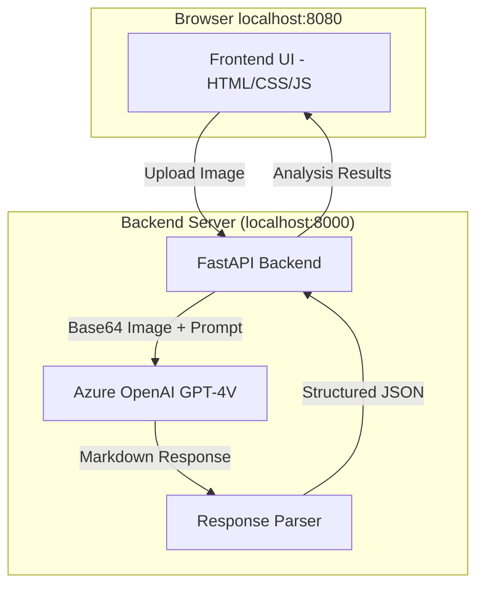
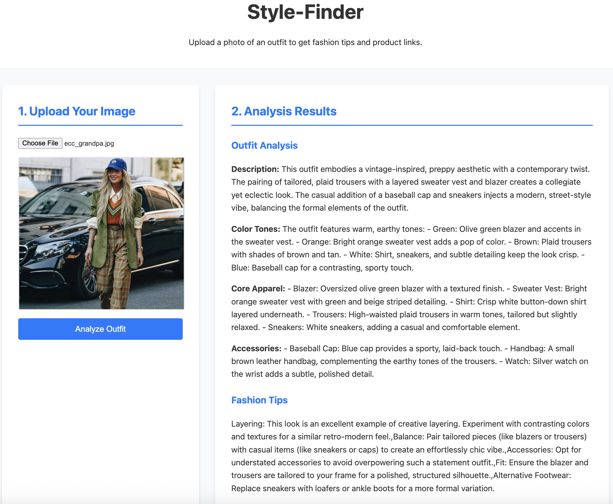

# Style-Finder  

## 1. Summary  
- **What it does:** A web application that takes a picture of a person's outfit as input, uses Azure OpenAI's GPT-4V to analyze the style, and provides fashion tips with links to similar items on Nordstrom.com.
- **Why it matters:** This app helps users discover and shop for styles that inspire them in the real world. It bridges the gap between seeing an outfit and knowing how to create it for yourself.

## 2. Technical Details
### Input/Output Flow
1. **Input:**
   - User uploads an image of an outfit through the web interface
   - Image is converted to base64 format for API transmission
   - Maximum supported file size: 20MB
   - Supported formats: JPEG, PNG

2. **Processing:**
   - Backend sends image to Azure OpenAI's GPT-4V API
   - Custom prompt engineering ensures structured analysis
   - Response is parsed into specific sections:
     - Overall style description
     - Color analysis
     - Core apparel identification
     - Accessories details
     - Fashion tips
     - Similar item suggestions

3. **Output:**
   - Structured JSON response containing:
     ```javascript
     {
       analysis: {
         description: string,    // Overall style description
         colorTones: string,     // Color analysis
         coreApparel: string,    // Main clothing items
         accessories: string     // Accessories details
       },
       fashionTips: string[],   // Array of styling suggestions
       suggestedItems: [{       // Similar items from Nordstrom
         name: string,
         description: string,
         imageUrl: string,
         productUrl: string
       }]
     }
     ```

### LLM Integration
- **Model:** Azure OpenAI GPT-4V (Vision)
- **API Version:** 2024-12-01-preview
- **Configuration:**
  - Max tokens: 1000
  - Temperature: 0.7
  - Response format: Markdown sections with clear headers
  - Structured prompt for consistent analysis

## 3. Quickstart

This project contains a Python backend and a JavaScript frontend. The following commands will get you up and running.

**Prerequisites:**
- [Node.js](https://nodejs.org/) (which includes `npm`)
- [Python 3.8+](https://www.python.org/) (and `pip`)
- Azure OpenAI API access with GPT-4V enabled

**Instructions:**

1.  **Clone the repository:**
    ```bash
    git clone <your-repo-url>
    cd vibe-lab-template
    ```

2.  **Install dependencies:**
    ```bash
    npm install && pip install -r requirements.txt
    ```

3.  **Configure Azure OpenAI:**
    Create a file named `.env` in the project root directory:
    ```bash
    AZURE_OPENAI_KEY=your_api_key_here
    AZURE_OPENAI_ENDPOINT=your_endpoint_here
    AZURE_OPENAI_DEPLOYMENT=your_deployment_name
    AZURE_OPENAI_API_VERSION=2024-12-01-preview
    ```

4.  **Run the application:**
    The easiest way to run both servers is using the provided script:
    ```bash
    chmod +x restart.sh
    ./restart.sh
    ```

    Or manually in separate terminals:

    Terminal 1 (Backend):
    ```bash
    cd vibe-lab-template
    python -m uvicorn src.backend.main:app --host 0.0.0.0 --port 8000 --reload
    ```

    Terminal 2 (Frontend):
    ```bash
    cd vibe-lab-template/src/frontend
    python3 -m http.server 8080
    ```

5.  **Access the application:**
    Open `http://localhost:8080/index.html` in your web browser.

## 3. Architecture
The application consists of a frontend single-page application, a Python backend API, and integrates with Azure OpenAI's GPT-4V for vision analysis.



**Project Structure:**
```
.
├── README.md           ← Project documentation
├── requirements.txt    ← Python dependencies
├── restart.sh          ← Convenience script to run servers
├── src/
│   ├── backend/
│   │   └── main.py    ← FastAPI application with GPT-4V integration
│   └── frontend/
│       ├── index.html ← Main application page
│       ├── style.css  ← Stylesheet
│       └── app.js     ← Client-side logic
└── .env               ← Azure OpenAI configuration
```

## 4. Demo
The application provides a clean, modern interface for uploading outfit images and receiving detailed style analysis:

1. Upload an image using the file picker or drag-and-drop
2. View the comprehensive analysis including:
   - Overall style description
   - Color palette breakdown
   - Core apparel identification
   - Accessories details
3. Get personalized fashion tips
4. Browse suggested similar items from Nordstrom

### Example Analysis

#### Input Image

*Example input image showing a stylish outfit for analysis*

#### Style Analysis Output

*Detailed style analysis showing outfit description, color analysis, and fashion recommendations*

## 5. How it Works
1. The frontend provides a simple interface for image upload and result display
2. When an image is uploaded, it's converted to base64 and sent to the backend
3. The backend:
   - Validates the image format and size
   - Sends the image to Azure OpenAI's GPT-4V with a structured prompt
   - Receives a markdown-formatted response
   - Parses the response into structured sections
   - Returns a JSON response to the frontend
4. The frontend displays the results in an organized, user-friendly format
5. Links to similar items are generated dynamically based on the analysis

## 6. Future Improvements
- Add support for multiple image uploads
- Implement user accounts to save favorite analyses
- Add more detailed product recommendations
- Integrate with additional fashion retailers
- Add sharing capabilities for social media
- Implement a mobile app version
