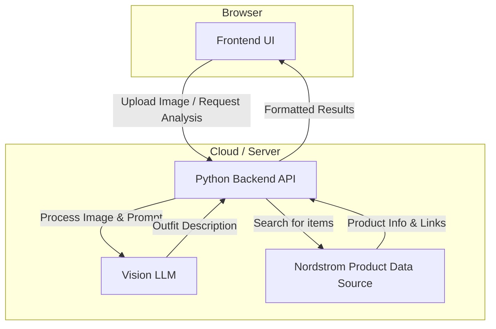

# Project Specification: Style-Finder

## 1. Project Overview

Style-Finder is a web application that allows users to upload a picture of an outfit they like. The application will then use a Large Language Model (LLM) to analyze the image, provide a description of the outfit, offer fashion advice, and suggest links to similar items available for purchase on Nordstrom.com.

## 2. Functional Requirements

### 2.1. User-Facing Features (Frontend)

- **FR1: Image Upload:** Users must be able to upload an image file (e.g., JPG, PNG) from their device.
- **FR2: Image Display:** The uploaded image should be displayed to the user.
- **FR3: Analysis Trigger:** Users can trigger the outfit analysis after uploading an image.
- **FR4: Results Display:** The application will display the following results to the user:
    - A textual description of the outfit and notes about color tones, core apparel and accesories that define the style of the outfit.
    - Fashion tips related to wearing the outfit.
    - A list of recommended clothing items with images, descriptions, and direct links to the product pages on Nordstrom.com.
- **FR5: Loading State:** The UI should indicate that the analysis is in progress after the user initiates it.

### 2.2. Backend Logic (Python)

- **FR6: Image Reception:** The backend server must be able to receive and process image uploads from the frontend.
- **FR7: Image Preprocessing:** The backend may need to resize or format the image before sending it to the LLM.
- **FR8: LLM Interaction:** The backend will send the image and a carefully crafted prompt to a multimodal LLM.
- **FR9: Nordstrom Product Search:** The backend will need a mechanism to find relevant products on Nordstrom.com based on the LLM's analysis of the clothing items.
- **FR10: API for Frontend:** The backend will expose an API for the frontend to upload images and retrieve analysis results.

## 3. Non-Functional Requirements

- **NFR1: Performance:** The analysis process should be reasonably fast. We should aim for the user to get results within 10-15 seconds.
- **NFR2: Usability:** The user interface should be simple, intuitive, and mobile-friendly.
- **NFR3: Scalability:** The application should be designed to handle multiple concurrent users.

## 4. Proposed High-Level Architecture

The system will be composed of three main parts:

1.  **Frontend:** A single-page application (SPA) built with a modern web framework (e.g., React, Vue, Svelte).
2.  **Backend:** A Python web server (e.g., using Flask, FastAPI, or Django) responsible for handling user requests, interacting with the LLM, and fetching product data.
3.  **Vision-Enabled LLM Service:** A third-party service like OpenAI's GPT-4V or Google's Gemini that can process image and text inputs.
4.  **Nordstrom Product Search/Retrieval:** A component to get product information from Nordstrom.

## 5. Key Decisions & Open Questions

This section lists critical questions that need to be answered to finalize the specification.

### 5.1. User Experience

- **Q1:** What is the desired user flow for uploading an image? (e.g., file picker, drag-and-drop, direct camera access?)
- **Q2:** Should we include user accounts to allow saving a history of analyzed outfits?

### 5.2. Technology Stack

- **Q3:** Do you have a preference for a Python web framework (e.g., FastAPI for its performance and modern features, Flask for simplicity, or Django for a more batteries-included approach)?

### 5.3. LLM Integration

- **Q4:** Do you have a specific multimodal LLM in mind (e.g., Gemini, GPT-4V)? This choice may affect the API and cost.

### 5.4. Nordstrom Product Integration (The Hardest Part)

This is the most significant technical challenge. How do we get relevant, up-to-date product information from Nordstrom?

- **Q5:** Does Nordstrom provide a public API for accessing its product catalog? A quick search suggests they do not have a public one for this purpose.
- **Q6:** If there's no API, what is the alternative?
    - **Option A: Web Scraping:** We could build a scraper for Nordstrom.com. This is often brittle (breaks when the website structure changes) and may be against their terms of service.
    - **Option B: Product Data Feed:** Sometimes retailers provide data feeds to partners. This would be ideal but requires a partnership.
    - **Option C: Retrieval-Augmented Generation (RAG):** We could pre-emptively scrape a subset of Nordstrom's catalog, store it in a vector database, and have the backend search this database for items that match the LLM's description. The LLM could even help generate the search queries for this database. This is a robust but complex solution.
    - **Option D: Use a Search Engine:** The LLM could generate search queries for a search engine (like Google or Bing) scoped to `site:nordstrom.com`. We would then use a search engine API to get results. This is less reliable for structured data but easier to implement than a full RAG system.

My recommendation is to investigate **Option D** or **C**. **Option C (RAG)** is the most professional and scalable approach but requires more effort.

What are your thoughts on these questions, particularly the approach for getting Nordstrom product data? This decision will significantly shape the project's architecture and implementation. 